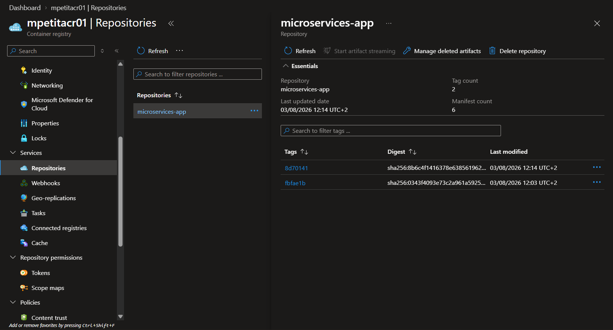

#  Microservices on AKS: continuous integration 


Three Go microservices (API Gateway, Books, Movies) shipped as one distroless image. This repository owns the code and the build: lint, test, image, push to Azure Container Registry, then it hands the tag over to the deployment pipeline.

> Brief: [docs/CONSIGNES.md](docs/CONSIGNES.md)
> Deployment repository: [simplon-kubernetes-azure-cd](https://gitlab.com/WhiteMuush/simplon-kubernetes-azure-cd)

## Why

Two decisions shape the whole pipeline.

**No registry password is ever stored.** GitLab mints a short-lived OIDC token (`id_tokens`), Azure trades it for a Service Principal session through workload identity federation, and `az acr login --expose-token` returns an ACR access token that expires within hours. The project variables hold identifiers only, never a secret.

**One tag per commit, never `latest`.** The image is tagged `$CI_COMMIT_SHORT_SHA`. A moving tag makes rollback impossible: the Deployment spec never changes, so Kubernetes has nothing to roll. A unique tag makes every deployment traceable and reversible.

The `deploy` stage deploys nothing here. It triggers the CD project with `TAG` as a variable, so a build job never holds cluster credentials.

## Architecture

```
        one image  ─  three binaries  ─  three Deployments

                gcr.io/distroless/static-debian12
                              │
              ┌───────────────┼───────────────┐
              │               │               │
          /app/api       /app/books      /app/movies
       (LoadBalancer)    (ClusterIP)     (ClusterIP)
```

The image declares no `ENTRYPOINT`. Each Deployment sets `command` to pick the binary it runs, which keeps one build and one tag for the three services.

| App | Endpoint | Exposure |
|---|---|---|
| api | `GET /data` | LoadBalancer, aggregates the two others |
| books | `GET /books` | ClusterIP |
| movies | `GET /movies` | ClusterIP |

The gateway resolves its backends by Service DNS name, injected as `BOOKS_API_HOST=books:8080` and `MOVIES_API_HOST=movies:8080`.

## Pipeline

```
  merge request ──▶ lint ─ test ─ build
  push on main  ──▶ lint ─ test ─ build ─ azure-auth ─ push ─ deploy (triggers CD)
```

| Stage | Image | What it does |
|---|---|---|
| `lint` | `golang:1.26` | `gofmt -l` fails on unformatted files, then `go vet ./...` |
| `test` | `golang:1.26` | `go test ./...` |
| `build` | `docker:27` + dind | Builds the image, proving the Dockerfile is sound on every branch |
| `azure-auth` | `azure-cli` | OIDC login, exports `ACR_TOKEN` as a dotenv artifact |
| `push` | `docker:27` + dind | Logs into ACR with that token, pushes `:$CI_COMMIT_SHORT_SHA` |
| `deploy` | trigger | Starts the CD pipeline with `TAG=$CI_COMMIT_SHORT_SHA` |

Only `lint`, `test` and `build` run on merge requests. Everything touching Azure is gated on the default branch.

## Requirements

Go 1.26, Docker, and the Azure CLI for local pushes.

These CI/CD variables must exist in the project settings. None of them is a secret:

| Variable | Example | Used by |
|---|---|---|
| `ACR_NAME` | `mpetitacr01` | image name, ACR login |
| `AZURE_CLIENT_ID` | Service Principal app id | `az login --federated-token` |
| `AZURE_TENANT_ID` | tenant of the subscription | `az login --federated-token` |

The Service Principal and its federated credential are created once on the Azure side, documented under [Azure setup](https://gitlab.com/WhiteMuush/simplon-kubernetes-azure-cd#azure-setup) in the CD repository.

## Local build

```bash
cp .env.example .env   # fill in ACR_NAME, .env is git-ignored
make release           # az acr login, docker build, docker push
make tags              # what the registry holds
```

`make help` lists every target. `TAG` defaults to the current commit SHA, the same tag the pipeline uses, so a local push and a pipeline push are interchangeable. `guard-env` stops the run when `ACR_NAME` is missing instead of building an image named `.azurecr.io/...`.



> **Docker-in-Docker**: the `build` and `push` jobs need the `docker:27-dind` service together with `DOCKER_TLS_CERTDIR: "/certs"`. Without that variable the client and the daemon disagree on TLS and the job dies on `Cannot connect to the Docker daemon`.

> **ACR token login**: the username is the literal null GUID `00000000-0000-0000-0000-000000000000`. It is not a placeholder to fill in, it is how ACR recognises a token-based login.

## Progress

| Step | Status |
|---|---|
| Azure environment: registry and cluster created | done |
| Image built and pushed by hand from the workstation | done |
| Manifests applied by hand, application reachable | done |
| CI: lint, test, build, secretless push to ACR | done |
| CD triggered by the CI with the commit tag | done |
| Application reachable on the load balancer IP | done |
| Access restricted to a single CIDR | done |

## Notes

- A local orchestrator (`Makefile`, one level above, not versioned) chains this repo and the CD repo: `make ship` runs `release` here, then `deploy` there, with the same tag.
- The pipeline never calls the `Makefile`. It repeats the build in its own jobs, so a broken `Makefile` cannot break the CI, and a missing runner cannot block a local push.
- The distroless runtime ships no shell, so `docker run -it ... sh` is not available for debugging. Use `--entrypoint /app/api` or inspect the layers instead.
